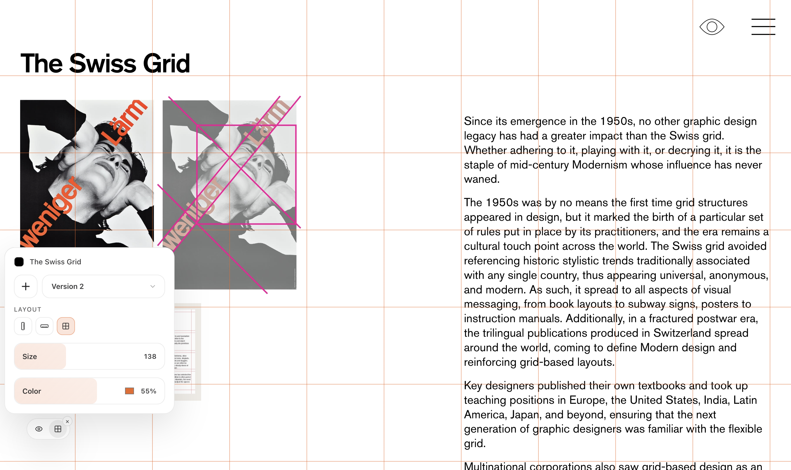
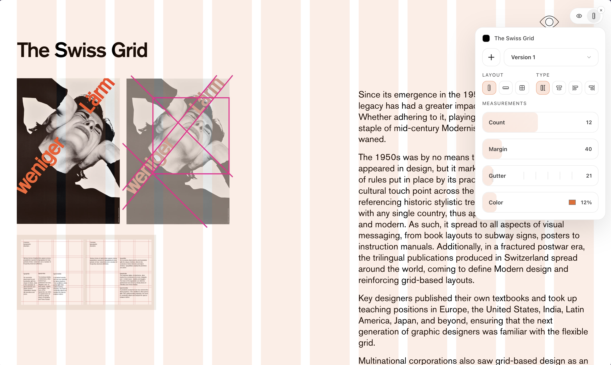

<p align="center">
  
</p>

<h1 align="center"><strong>another-grid-plugin</strong></h1>

<p align="center">
  A browser extension that overlays configurable grid systems on any webpage.
</p>

<p align="center">
  Inspired by the discipline and clarity of <em>Grid Systems in Graphic Design</em> by Josef Müller-Brockmann — structure, rhythm, and alignment without visual noise.
</p>

## Samples

Square grid overlay with the in-page controls:

<p align="center">
  
</p>

Column grid overlay:

<p align="center">
  
</p>

## Features

- **Column, row, and square grids** — switch layout type from the floating toolbar
- **Presets and versions** — built-in defaults plus per-site custom variations
- **Measurements** — count, size, margin, gutter, color, and opacity (simplified controls in square-grid mode)
- **Per-site memory** — patterns and settings persist for each hostname
- **Lightweight overlay** — draggable toolbar, minimal UI, no page takeover

## Install

### From source

```bash
git clone https://github.com/IvanCCO/another-grid-plugin.git
cd another-grid-plugin
npm install
npm run build
```

1. Open `chrome://extensions` (or `edge://extensions`)
2. Enable **Developer mode**
3. Click **Load unpacked**
4. Select the `dist/` folder

### From a release

Download `another-grid-plugin.zip` from the [latest GitHub release](https://github.com/IvanCCO/another-grid-plugin/releases), unzip it, and load the folder as an unpacked extension.

After code changes, run `npm run build` again, then reload the extension and refresh the page.

## Development

```bash
npm run test        # unit tests
npm run lint        # ESLint
npm run build       # type-check, bundle, and copy assets → dist/
npm run watch       # rebuild on file changes
npm run package:extension  # zip dist/ for distribution
```

Pull requests run lint, tests, build, and packaging in GitHub Actions. See [CONTRIBUTING.md](./CONTRIBUTING.md) for commit conventions and release flow.

## Project structure

| Path | Role |
| --- | --- |
| `src/content.ts` | Overlay UI, settings, and messaging |
| `src/content/grid-render.ts` | Grid drawing (columns, rows, line grid) |
| `src/site-patterns.ts` | Per-site presets and variations |
| `public/content.css` | Overlay and popover styles |
| `dist/` | Built extension (load this in the browser) |

## License

See repository license terms.
